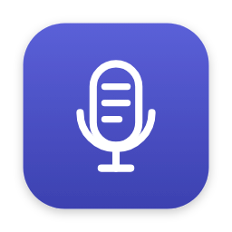

# speech-logger — design system

The visual identity for **speech-logger**, a calm macOS menubar app that turns speech into
organized text without changing what was said. This document is the source of truth for the
mark, the color system, typography, and how the assets are wired into the app.

> **Symbol-led identity.** The mark carries the brand on its own: it reads at menubar size
> with no wordmark next to it, which is where the app actually lives.

A browsable version of this guide is published as an Artifact:
<https://claude.ai/code/artifact/ac12e0f8-1a9f-40d8-bba8-24bb2303a6b9>

---

## 1. Concept

The product captures speech (podcast / microphone) and returns tidy, faithful text (an
archive, a log). One drawing carries both halves of that promise:


A **microphone capsule** whose interior is **three lines of organized text** — a settled
paragraph, the log item, the archive. It reads at a glance, works monochrome, survives to
16 px in the menubar, and never depends on the final name.

The brand is **calm and native to macOS**: it speaks the system's own visual language (SF Pro,
SF Symbols proportions, the squircle) rather than shouting over it — because the app itself is
quiet and lives in the background.

---

## 2. The symbol

`brand/svg/mark.svg` — viewBox `0 0 96 96`, single color via `currentColor`.

| Part | Meaning |
|---|---|
| **Capsule** — vertical rounded rect (high `rx`) | The microphone silhouette. The "speech / podcast" gesture the eye recognizes instantly. |
| **Three lines** — decreasing length, inside the capsule | The organized text: a settled paragraph, the log item, the archive. |
| **Stand** — holder arc, stem, base | The mic foot. Confirms "microphone" without a word and stabilizes the composition. |
| **Stroke & radius** | One stroke weight, rounded caps, proportional radii. All in `currentColor` so it inherits the menubar tint and becomes a mono template. |

**Clearspace:** keep at least the height of one interior text line clear on every side. Never
crowd the wordmark closer to the symbol than the capsule width.

---

## 3. Menubar glyph family

The menubar shows **one** glyph at a time. When several states are true, the highest on the
ladder wins — the same rule already in the code
([`MenubarState.resolve`](../Sources/SpeechLoggerCore/MenubarState.swift)). The glyph reflects
**status**; it never signals "ready" (that is the notification's job).

The family is built by keeping the capsule constant and changing **what is inside it**:

| Priority | State | Interior | Asset |
|:--:|---|---|---|
| 1 (highest) | `recording` | solid capsule — the mic is live | [`state-recording.svg`](svg/state-recording.svg) |
| 2 | `failed` | an exclamation | [`state-failed.svg`](svg/state-failed.svg) |
| 3 | `needsPermission` | a padlock — the hotkey is locked out | [`state-needs-permission.svg`](svg/state-needs-permission.svg) |
| 4 | `processing` | three working dots | [`state-processing.svg`](svg/state-processing.svg) |
| 5 (lowest) | `idle` | the three text lines (the mark at rest) | [`state-idle.svg`](svg/state-idle.svg) |

All five are single-color, `isTemplate`-safe: on the bar the glyph inherits the system tint.
The semantic colors (below) belong **inside the panel**, where there is room for them — not on
the bar.

### Wiring them into the app (optional next step)

The app currently draws these states with SF Symbols in
[`MenubarController.symbolName(for:)`](../Sources/SpeechLogger/MenubarController.swift). To ship
the brand glyphs instead, add each SVG as a **template imageset** in
`Sources/SpeechLogger/Resources/Assets.xcassets` (rendering intent: *template*, preserve vector
data), then load with a safe fallback so the build never depends on the asset resolving:

```swift
private func render() {
    guard let button = statusItem.button else { return }
    let image = NSImage(named: Self.assetName(for: state))
        ?? NSImage(systemSymbolName: Self.symbolName(for: state), accessibilityDescription: accessibility)
    image?.isTemplate = true
    image?.size = NSSize(width: 18, height: 18)   // match the menubar cap height
    button.image = image
    button.title = state == .recording ? " \(Self.clockText(recordingSeconds))" : ""
}
```

This is left as a follow-up because the menubar glyph size needs on-device visual tuning; the
app icon (below) is wired now.

---

## 4. Wordmark & lockups

The wordmark is set in the **system face** (SF Pro on macOS — the app's own UI font), all
lowercase, weight 600, tight tracking, with the hyphen in slate. Using the system face is a
deliberate choice, not a shortcut: the mark speaks the exact language the app draws its UI in.

- Horizontal lockup — app bars, headers: [`lockup-horizontal.svg`](svg/lockup-horizontal.svg)
- Vertical lockup — about screens, splash: [`lockup-vertical.svg`](svg/lockup-vertical.svg)

The lockups pin `color` to ink, so they need a light background. Where the background follows a
theme the caller does not control (a README on github.com), pair the light file with
[`lockup-horizontal-dark.svg`](svg/lockup-horizontal-dark.svg) — same geometry, ink and hyphen
swapped for their dark tokens — behind a `<picture>` + `prefers-color-scheme` switch.

Prefer the **symbol alone** wherever space is tight (menubar, favicon).

---

## 5. App icon

`brand/svg/app-icon.svg` is the source; the compiled icon lives in
[`Sources/SpeechLogger/Resources/Assets.xcassets/AppIcon.appiconset`](../Sources/SpeechLogger/Resources/Assets.xcassets/AppIcon.appiconset)
and is wired in [`Project.swift`](../Project.swift) via `ASSETCATALOG_COMPILER_APPICON_NAME`.



The icon **inverts** the mark: a white capsule on the brand indigo, in the macOS squircle
(820 px plate with padding inside the 1024 grid, corner radius 184, a soft drop shadow). This is
the one place the brand color fills the frame.

The app is accessory (`LSUIElement`, no Dock icon), but the icon still appears in Finder, the
installer, and notifications.

**Sizes generated** (`icon_16 … icon_1024.png`), mapped in the `.appiconset` `Contents.json`:
16, 32, 64, 128, 256, 512, 1024 px — covering every `mac` idiom `@1x`/`@2x` slot.

### Regenerating the raster

The PNGs are rendered from the SVG with headless Chromium (no rasterizer dependency to install):

```sh
# from repo root, sizes cover all appiconset slots
node brand/scripts/render-appicon.js
```

The script wraps `brand/svg/app-icon.svg` at each pixel size with a transparent background and
writes the PNGs straight into the `.appiconset`. Edit the SVG, re-run, done.

---

## 6. Color

Neutrals carry a slight indigo bias — not pure gray — so the palette feels chosen and coheres
without shouting. There is **one** accent; the semantic colors are separate from it and map to
the real item states.

### Core (light)

| Token | Hex | Use |
|---|---|---|
| Indigo · accent | `#5257CE` | The brand accent, used sparingly |
| Indigo · deep | `#3C41B0` | Hover / pressed / icon gradient bottom |
| Ink | `#171922` | Text, the mono mark |
| Slate | `#656A7E` | Secondary text, the hyphen |
| Hairline | `#E4E6EF` | Borders, dividers |
| Paper | `#F5F6FA` | Background |
| Surface | `#FFFFFF` | Cards, the panel |

### Core (dark)

| Token | Hex |
|---|---|
| Indigo · accent | `#8B90F0` |
| Ink | `#ECEDF4` |
| Slate | `#9AA0B4` |
| Hairline | `#2A2D3A` |
| Paper | `#101119` |
| Surface | `#191B25` |

### Semantic — the item states

| State | Light | Dark |
|---|---|---|
| Recording | `#E5484D` | `#FF6166` |
| Processing | `#5257CE` | `#8B90F0` |
| Failed | `#D9820A` | `#F0A83A` |
| Ready | `#2F9E68` | `#4FBF88` |

The app icon gradient runs `#5B60D8 → #3C41B0`.

---

## 7. Typography

The identity uses the operating system's own faces — on purpose. It is honesty, not laziness:
the app draws its UI in SF Pro, so the brand speaks the same language and never clashes with the
bar. Character comes from the symbol, the color, and the monospace detailing.

| Role | Stack | Use |
|---|---|---|
| Display | `-apple-system, BlinkMacSystemFont, "SF Pro Text", system-ui` | Headings; weight 600–700; tracking `-0.02em`; `text-wrap: balance` |
| Body | same, weight 400/600 | Running text; line height ~1.55; measure ~65 characters |
| Contract voice | `ui-serif, "New York", Georgia` | Italic; **only** for fidelity-contract quotes and the manifesto |
| Data & marks | `ui-monospace, "SF Mono", Menlo` | Labels, the recording clock, identifiers (`/sync`), the noise mark `[? … ?]` |

---

## 8. Voice

The contract is the product: **everyone summarizes; this one reorganizes — and preserves every
word.** Copy is direct, calm, in pt-BR, present tense, no inflated promises. We never promise
"better" text — we promise **faithful** text. The word "summarize" appears only to say what we
do *not* do.

---

## 9. Usage

**Do**

- Use the symbol in `currentColor`; let it inherit the menubar tint.
- Keep one text-line of clearspace around the mark.
- Prefer the symbol alone where space is tight.
- Fill with indigo only on the app icon; in UI, use the accent sparingly.

**Don't**

- Tilt, distort, or add shadow/gradient to the mono glyph.
- Recolor the symbol with semantic colors outside a state context.
- Replace the capsule with a "realistic" mic or the 🎙️ emoji.
- Use a state glyph to signal "ready" — that is the notification's job.

---

## 10. File map

```
brand/
  DESIGN_SYSTEM.md            ← this file
  scripts/
    render-appicon.js         ← SVG → appiconset PNGs (headless Chromium)
  svg/
    mark.svg                  ← primary symbol
    lockup-horizontal.svg
    lockup-horizontal-dark.svg  ← ink-on-dark variant, for dark-theme READMEs
    lockup-vertical.svg
    app-icon.svg              ← app-icon source (squircle + white mark)
    state-idle.svg
    state-recording.svg
    state-processing.svg
    state-failed.svg
    state-needs-permission.svg

Sources/SpeechLogger/Resources/Assets.xcassets/
  AppIcon.appiconset/         ← compiled app icon (wired in Project.swift)
    Contents.json
    icon_16 … icon_1024.png
```
